Please do read README.md in `experiments` and `experiments/final_results`.

Benchmarking and understanding behaviour of index structures using PiBench (also used in OptiQL) for 
tiered memory (with a remote CXL-enabled node) under different tiering schemes : TPP+AutoNUMA and 
DAMON(HMSDK).

AutoNUMA = numa_balancing = 2
TPP = demotion_enabled = true
DAMON = using DAMON memory-tiering command and using migrate-hot and migrate-cold actions.

V. IMP : For numa_balancing=2 promotions/demotions to work, we need our system to recognise different memory tiers. That is, more than one tiers in `/sys/devices/virtual/memory_tiering/memory_tier*`.

For that if your both nodes are of same memory type, you will need to modify kernel source. The patch at HMSDK github issue, though created the two tiers was not able to bring about pgpromote_success increments. I still don't know why. (Even increased CXL_MEM_DIST to `10*DRAM_DIST` compared to `5*DRAM_DIST` as described in the issue, but that didn't help).

However, following path from colloid-tb repo worked. So the patch and installing the kernel module makes the two tiers visible which also show promotions/demotions. So this works and is also flexible (the module can be loaded/unloaded at will). Details of the kernel modification at : [tierinit patch](https://github.com/RoopamTaneja/tierinit-patch-colloid-tb-my-version).

Also alongside, make sure to turn on DAMON kernel config options.

Like my .config before building looked like:

```bash
$ grep -i damon .config

CONFIG_DAMON=y
CONFIG_DAMON_VADDR=y
CONFIG_DAMON_PADDR=y
CONFIG_DAMON_SYSFS=y
CONFIG_DAMON_RECLAIM=y
CONFIG_DAMON_LRU_SORT=y
CONFIG_DAMON_STAT=y
CONFIG_DAMON_STAT_ENABLED_DEFAULT=y
# DAMON Samples
# CONFIG_SAMPLE_DAMON_WSSE is not set
# CONFIG_SAMPLE_DAMON_PRCL is not set
# CONFIG_SAMPLE_DAMON_MTIER is not set
# end of DAMON Samples
```

A quick overview of damo command we use as bash file `damon-mem-tier.sh`:

```bash
"$damo_bin" module stat write enabled N # -> something which damo throws a warning for if not done
"$damo_bin" start \
        --numa_node 0 --monitoring_intervals_goal 4% 3 5ms 10s \
                --damos_action migrate_cold 1 --damos_access_rate 0% 0% \
                --damos_apply_interval 1s \
                --damos_quota_interval 1s --damos_quota_space 200MB \
                --damos_quota_goal node_mem_free_bp 0.5% 0 \
                --damos_filter reject young \
        --numa_node 1 --monitoring_intervals_goal 4% 3 5ms 10s \
                --damos_action migrate_hot 0 --damos_access_rate 5% max \
                --damos_apply_interval 1s \
                --damos_quota_interval 1s --damos_quota_space 200MB \
                --damos_quota_goal node_mem_used_bp 99.7% 0 \
                --damos_filter allow young \
                --damos_nr_quota_goals 1 1 --damos_nr_filters 1 1 \
        --nr_targets 1 1 --nr_schemes 1 1 --nr_ctxs 1 1
```

`--monitoring_intervals_goal 4% 3 5ms 10s` : This means tweaking monitoring intervals to capture 4% of accesses in 3 aggregate intervals, such that sample_interval is allowed to vary between 5ms and 10s. Should be probably left untouched.

`--damos_action migrate_cold 1 --damos_access_rate 0% 0%` : Applying migrate_cold (demotion), sending to 1 all pages with access rate 0% (not touched in last aggregate_interval). This also need not be modified.

`--damos_action migrate_hot 0 --damos_access_rate 5% max` : Applying migrate_hot (promotion) sending to node 0 all pages with access >= 5%. 5% is a good default.

`--damos_apply_interval 1s` : Actions are applied after every 1s, this also looks reasonable.

`--damos_quota_interval 1s --damos_quota_space 200MB --damos_quota_goal node_mem_free_bp 0.5% 0` and `--damos_quota_interval 1s --damos_quota_space 200MB --damos_quota_goal node_mem_used_bp 99.7% 0` : Key values that **can be modified**. Quota suggests that DAMOS actions will aim to have 99.5% and 99.7 % usage of node 0 (some overlap helps avoid stagnation). However, the static DAMOS quota space allows to put an upper cap (200 MB/s in this case) on migration overhead, this is the main value which I think can be tweaked, others look good as default.

From the same doc, for stats we start query the sysfs files provided and to ensure they are refreshed timely, we first echo 100 ms into `kdamonds/N/refresh_ms` and thus we get no of pages those actions are applied to by reading from `/kdamonds/N/contexts/0/schemes/0/stats/sz_applied` and dividing by page size.

More info here : [damo issue](https://github.com/damonitor/damo/issues/34)  and here : [hmsdk issue](https://github.com/skhynix/hmsdk/issues/6).

Pls look at these GitHub issus.

[Future Scope] : Maybe try different combination of tiering schemes suggested by sjp38 here : https://github.com/damonitor/damo/issues/34#issuecomment-3341920062. Also maybe try tweaking damon command above or tweaking autonuma numa_balancing config aggressiveness wrt scan_suize,, scan_interval etc.

Also : pls have lru_gen_enabled = true (like 0x0007). And zone_reclaim_mode = 0 so reclaim doesn't interfere.

Hence, tiering metrics : Autonuma : `pgpromote_success` and `pgdemote_kswapd`. DAMON `migrate_hot_pages` and `migrate_cold_pages`, which are just obtained by `sz_applied // PAGE_SIZE`.

Benchmarks used : GUPS, GUPS with a defined hotset region, Memtis-Btree, MASIM synthetic workload and PiBench.

Aim to understand, how fast a small hot working set of an otherwise large index benchmark spanning both 
nodes, be promoted to the faster tier, and what improvement it brings in throughput.

Ideally, we expect the hot working set to be quickly promoted and the no of promotions to stagnate.

Summary of modifications to run.py and other scripts:
1. Used existing monitoring support for vmstat and added that to run.py
2. Added monitoring support for DAMON memory-tiering stats in run.py
3. Added command line args to run different benchmarks from run.py
4. Also added benchmark-specific args for PiBench in run.py
5. Added support for easily using existing options (memhog, mon-perf etc) in run.py
6. Also, just specify desired mem-ratio and RSS of benchmark and run.py will automatically calculate and hog required memory on node 0 with userspace memeater.
7. Added basic parsing support for PiBench stdout in `parse_common_results()` in `bench/scripts/launch_helpers.py`, but masim and btree scripts use the raw stdout output directly.
8. Modification to `apps/index-benchmarks/latches/OMCSOffset.h`, changed `numa_alloc()` to `malloc()`:
   
```c
  //base_qnode = (QNode *)numa_alloc_interleaved(npages * PAGE_SIZE);
  base_qnode = (QNode *)malloc(npages * PAGE_SIZE);

  //base_qnode = (QNode *)numa_alloc_onnode(sizeof(QNode) * Lock::kNumQueueNodes, node);
  base_qnode = (QNode *)malloc(sizeof(QNode) * Lock::kNumQueueNodes);
```

Notes for self: (Conclusions from initial experiments)

- `numactl --membind 1` : *High no of numa_other* but *no numa_miss, hint_faults or pte_updates*. Assuming the reason to be the fact that due to membind, kernel didn't try allocating at node 0 at all, leading to no misses.
- numactl has introduced weighted-interleave mode, however that is just restricted to allocation. DAMON is also bringing updates to have dynamic weights for weighted interleave, using migration actions to match the weights. Worth exploring but not our matter of concern here.
- Though had added option in `run.py` to pass interleave ratio with `--numa_interleave` to make use of numactl weighted interleave, but since it wouldn't help our cause, didn't explore further.
- from numa_balancing = 0 to 1 to 2 : we see a rise in numa hits, fall in numa misses. numa_balancing = 1 does not have pgpromote_success non-zero, while numa_balancing = 2 has it.
- As a side-quest, updated pcm version of pibench repository in my fork to make pcm inside pibench work for newer architectures (though it wasn't used in the end).
- So the pibench in `bench/apps/index-benchmarks` now points to my fork with updated pcm.
DAMON : Monitor -> Deals with regions adjustment, interval auto-tuning etc

DAMOS : Operations -> Deals with applying actions, quotas, priorities, filters and watermarks.

For our usecase, we wish to monitor using DAMON and apply actions using DAMOS.


DAMON New Feature : 

Monitoring Interval auto-tuning:


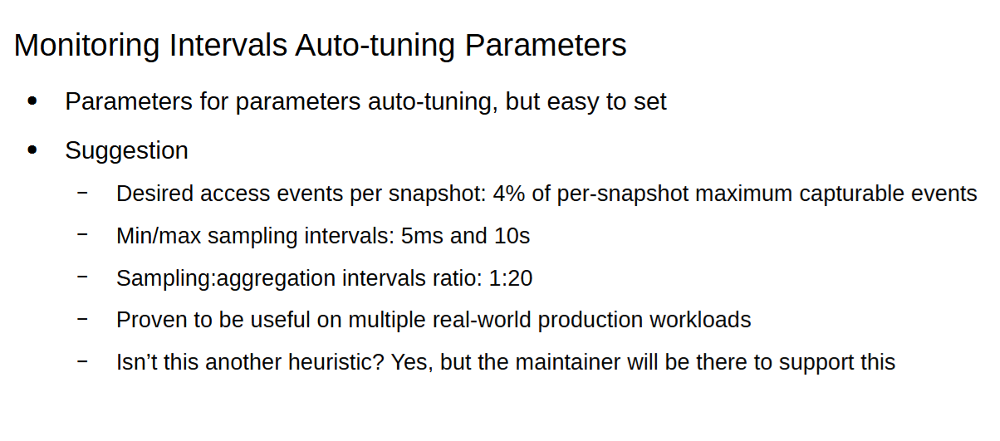

Taken from [1]

Quota auto-tuning:

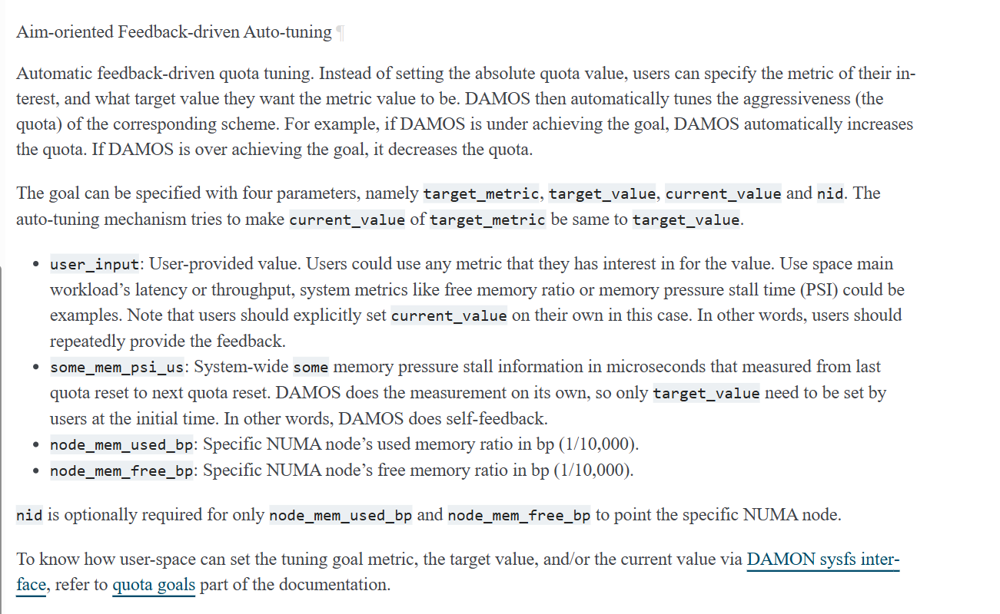

Great document : [2]

Important : 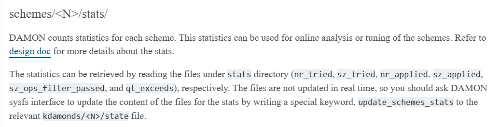

# PiBench benchmark

Due to above mentioned issues (making two memory tiers visible to kernel : fixed by local patch and the fix by Musa to remove the cap on processor frequency), initial PiBench experiments don't show promotions or problems like `--membind 1` having better performance than `--membind 0`. Hence, most of them are not very useful and just stashed in `experiments/old_experimental_results`.

# MASIM benchmark

IMP : MASIM is single-threaded. So no difference by varying no of threads.

More info on the SJP github repository. After some trials and errors, settled on this config script:

```text
r0, 40000000000, none
r1, 10000000000, none

p0
20000
r0, 0, 4096, 1, wo

p1
50000
r1, 0, 4096, 1, wo

p2
100000
r1, 0, 4096, 1, ro
```

For **1:1 ratio**, hogged by userspace memeater on node0:


Though you can get info about meaning of these parameters from the SJP github repo, briefly:
- r0 and r1 are regions. Treating r1 as my hotset.
- Since if two regions are accessed in same phase, their accesses are interleaved, thus important for their allocation phases (p0, p1) to be different. Then for 1:1 , we ensure, that r0 completely occupies node0 and some space on node1. Thus hotset r1 is guaranteed to start from node1. They must have writes to actually increase RSS.
- So in p0, only 40G of r0 allotted alone and they ofc occupy node0 fully (since there's only 25G there), and hence r1 in p1 allocated to node 1. p2 only accesses 10G of that hotset initially on node 1.
- Since it's 5e9 bytes, RSS is roughly 47.6G.
- In the phase p2 (our measurement phase), we sequentially access r1 (hotset). Sequential access allows a predictable WSS (checked using wss tool, its close to 9.4G for 1s).

Goal from this benchmark : Validate autonuma promotions performing better than baseline. Successful in demonstrating that:

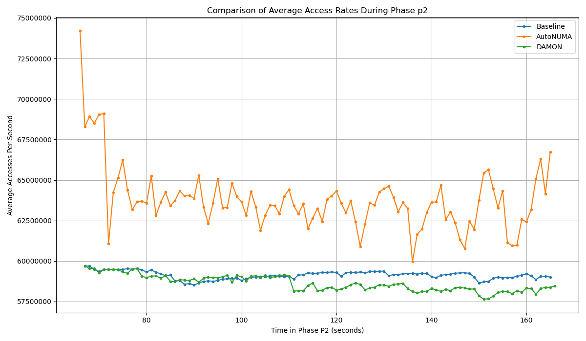

This iss timeseries of values at per 1 second timestamp, averaged over 5 runs. Produced using `--log_interval=1000` in command, can be modified if desired. Plots and comparison of average no of migrations in `final_results/masim_correct_run/` directory.

The results for the above config along with plots are saved in `experiments/final_results/masim_correct_run`. Further details in `masim_correct_run/README.md`.


So for 1:1 case, we see a clear improvement over baseline (damon though is still quite similar to baseline).

No of migrated pages is also significantly higher for autonuma than damon.

NOTE : WSS gathered using `wss.pl` script from [WSS-brendan-gregg](https://github.com/brendangregg/wss) using default : `sudo ./wss.pl <pid> <time>`.

WSS values gathered for PiBench:

WSS from ./wss.pl

membind0 1s
RSS : 30G

UNIFORM 28.3 G
SELFSIMILAR 0.5 28.2G
SELFSIMILAR 0.2 26.4G
SELFSIMILAR 0.1 24.6G
SELFSIMILAR 0.01 15.7-16G
SELFSIMILAR 0.005 11.7G
SELFSIMILAR 0.004 10.4G
SELFSIMILAR 0.002 7.5G
SELFSIMILAR 0.0015 6.3G
SELFSIMILAR 0.001 4.9G

ZIPFIAN
0.5 27.7 G
0.9 26G
0.99 23.7G
0.999 23.6G
0.9999 23.4G

# BTree benchmark

Memtis-btree : Using the new updated code which track throughput. THe only proper run : `experiments/final_results/final_new_btree_run`.

No. of Elements: 400M

No. of Lookups: 5000000000M

Secs to run: 120

RSS : 39.8GB, to make WSS smaller, find restricted to `% (NUM_ELEMENTS/4)`, RSS around 17-18G. hence results for MEMBIND0, MEMBIND1, 1:1 and 2:1 for 8, 16 and 28 threads. Further details in respective READMEs. Further details in `experiments/final_results/README.md`

comparison for throughput and no of migrations and throughput logged per second plotted as time series. All values averaged over 5 runs.

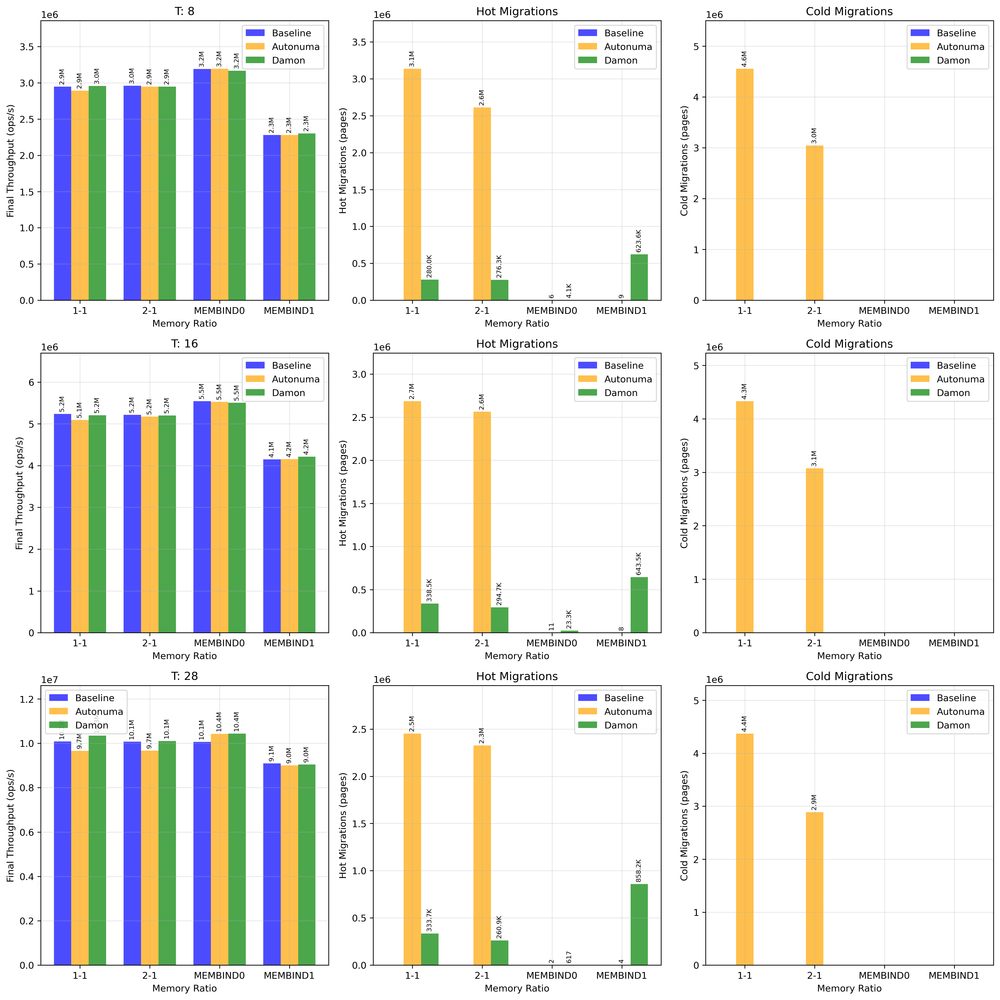

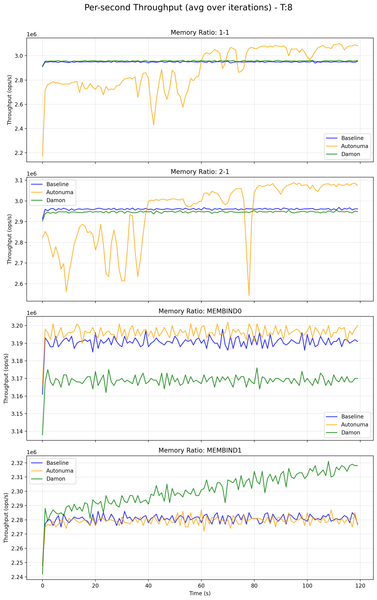

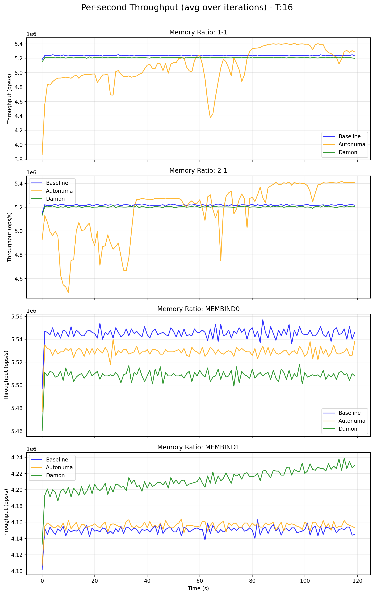

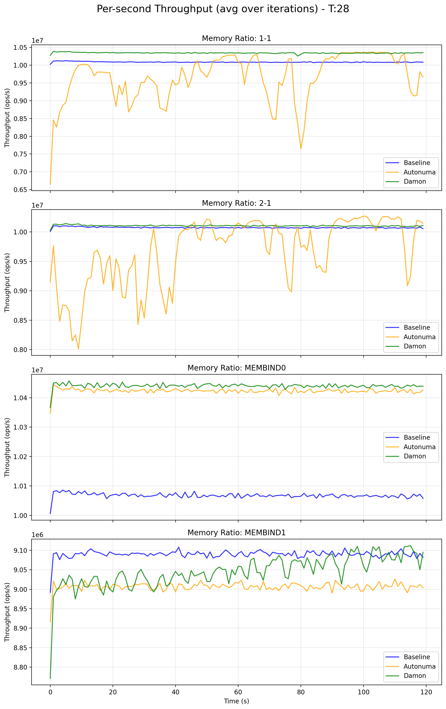


## Index benchmark

Further details in `experiments/final_results/README.md`

First proper run : 

Json,csv, png in `experiments/final_results/index_first_proper_run`

Graph :

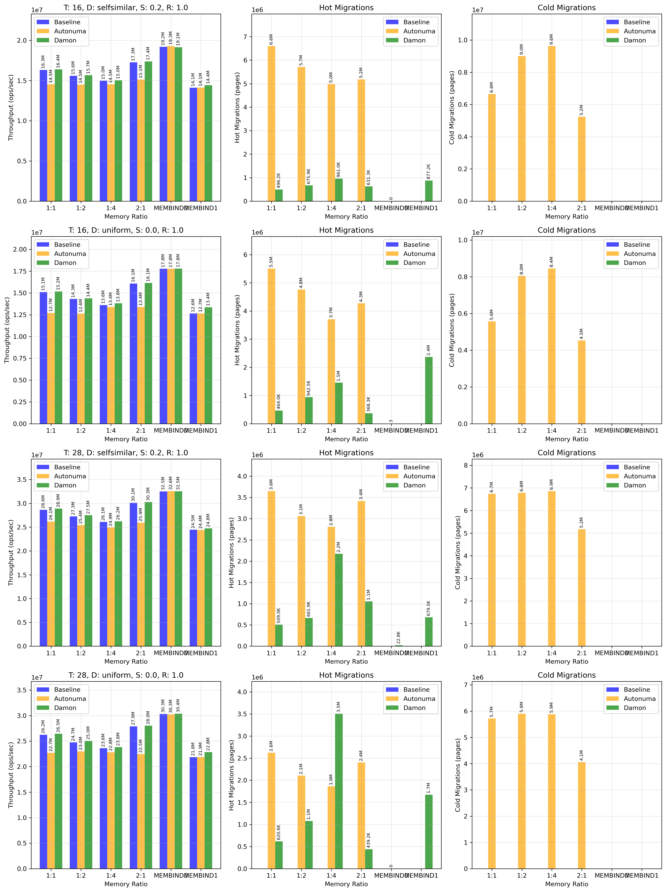

conclusions :

These benchmarks for a subset of configs completed, a basic conclusion coming is that under current settings throughput is slightly degrading for autonuma while either remaining same or improving for damon (even though no of promotions may not be as aggressive). A possible reason can be as mentioned here : https://lore.kernel.org/all/20250420194030.75838-1-sj@kernel.org/T/#u, the synchronous nature of autonuma vs asynchronous nature of damon

This is just for a subset: 16 vs 28 threads and self similar vs uniform:
keeping everything same: 28 threads gives an increase of 1.7-1.8x (expected since 28 threads are 1.75 times of 16, so almost linear increase)
just comparing self-similar (skew=0.2) with uniform, throughput is always higher for selfsimilar (perhaps due to lower cache misses, not sure on this)
no of pages migrated by autonuma >> damon (except one case), maybe that aggressiveness can be tuned with parameters
almost no demotions by damon, something also found in results here : https://lore.kernel.org/all/20250420194030.75838-1-sj@kernel.org/ (btw demotion_enabled = false, since we were focussing on damon demotions only)
throughput for membind cases is almost same for autonuma, no tiering, damon, with some improvement in damon (damon doesn't care about membind boundaries and still has migrate_hot actions unlike autonuma)
Throughput in autonuma in most cases is worse than no tiering -> perhaps due to its synchronous nature or overaggressiveness, like mentioned in results here ; https://lore.kernel.org/all/20250420194030.75838-1-sj@kernel.org/
The expectation of throughput for a particular scheme as : membind0 > 2:1 > 1:1 > 1:2 > 1:4 > membind1 is well respected (except a couple of exceptions)

WSS difference (i checked with membind0) is not huge but it's there: around 26.4G for 1s for self-similar (0.2 skew) and around 28.3G for uniform out of RSS of 30G.

Realising maybe we would like a smaller WSS that fits in node0 completely, that would help us to judge better, so used skew 0.1 and 0.01 with self-similar and generated following results (can be checked in `index_skew_1e-2_run/` and `index_skew_1e-3_run/`, using memory ratios allowing them to completely fit in node0):

Comparing throughputs for different schemes for self-similar with skews 0.2, 0.01 and 0.001 (in that order):

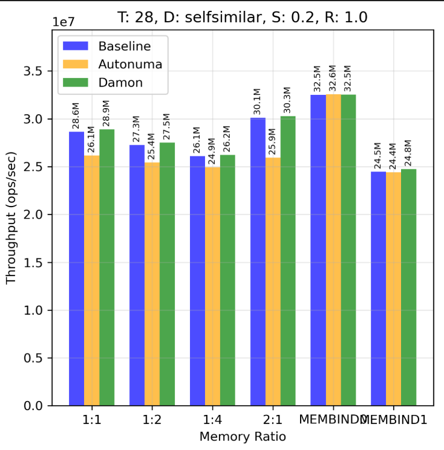

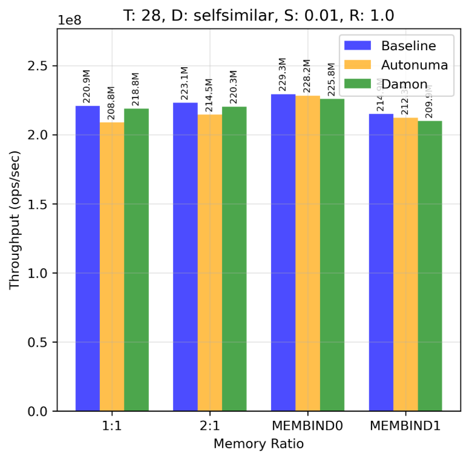

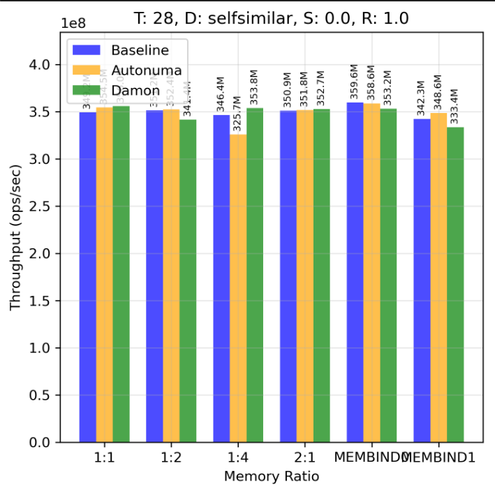

Observations:

- With more skewed access, (like 0.01 and 0.001), the throughput, increases manifold : (skew 0.2 vs skew 0.01 -> throughput becomes 7-8x and skew 0.2 vs 0.001 becomes 12-13x)
- For skew 0.01 : nos are baseline > autonuma , damon. damon lost its slight advantage it had vs baseline in uniform and 0.2 skew. autonuma is still behind but %age gap is much lesser.
- For skew 0.001: no clear trends of one being ahead of others, pretty mixed trend and also the gap between each other is pretty low
- as earlier, damon has only promotions and no visible demotions and their absolute nos are lower than autonuma

BTW, complete graph for skew 0.01 run:

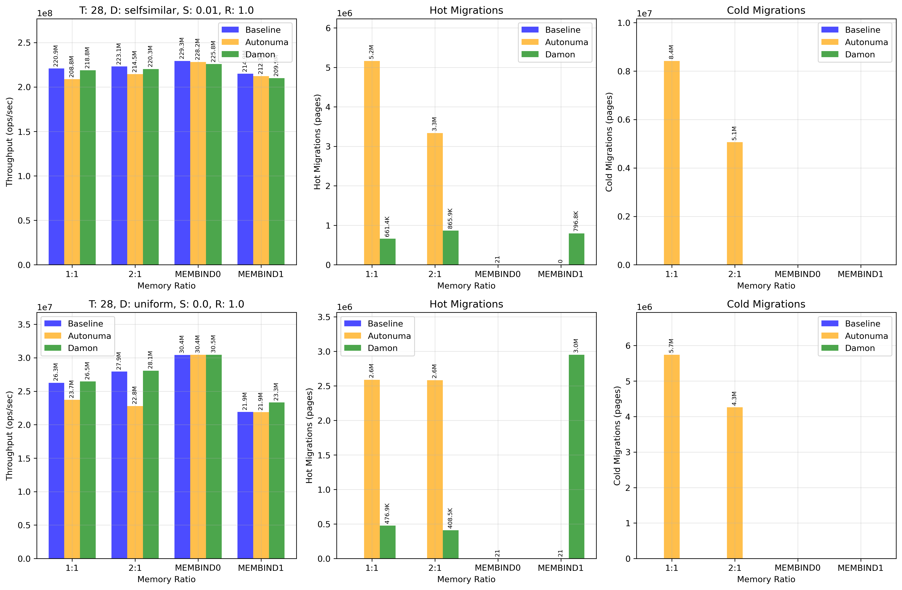

For skew 0.001 run:

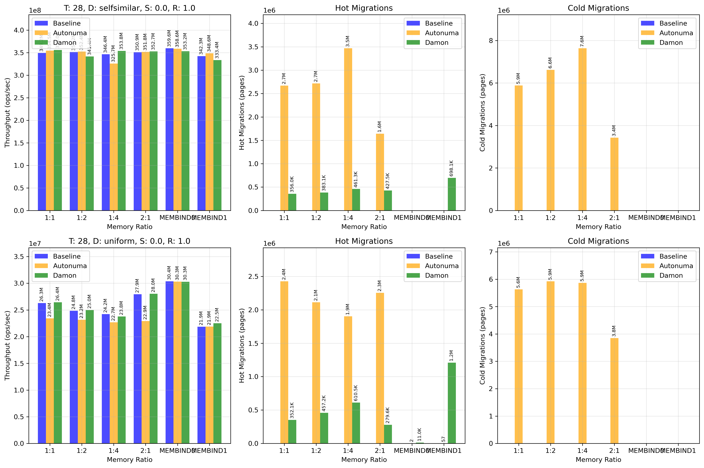

Then finally executed a full run of the benchmark but since it was pretty long (~18 days) had to interrupt after 2 days. By that time, we could complete all configs for 16 and 28 threads for autonuma. 

Configs are:

- thread_counts = [28, 16, 8, 4, 2, 1]
- read_write_ratios = [{"read": 1, "update": 0}, {"read": 0.8, "update": 0.2}, {"read": 0.5, "update": 0.5}, {"read": 0.2, "update": 0.8}, {"read": 0, "update": 1}]
- distributions = [{"name": "SELFSIMILAR", "skews": [0.01, 0.1, 0.2, 0.5]}, {"name": "UNIFORM", "skews": [None]}]
- mem_ratios = ["MEMBIND0", "MEMBIND1", "1:1", "2:1", "1:2", "1:4"]
- seconds = 120
- records = 1000000000

All graphs in `experiments/final_results/cxl_index_final_long_run_partial-autonuma_t16_28`. Look at `individual_graphs/`, `vary_read_ratio/`, `vary_skew/`, `vary_threads/`. Some observations:

- Varying read ratio and keeping others constant, general trend in throughput is ofc, MEMBIND0 >> shared > MEMBIND1. 
  - However, for large WSS, the values across shared ratios (1:1, 1:2 etc) are quite close to each other and only discernible trend is MEMBIND0 >> rest. Also, there is not much difference across read ratios for a particular mem ratio. 
  - But, as WSS decreases (like skew 0.2), gap between values across read ratios increases (read ratio=1.0 surpasses others by a good margin) and also the trends across mem ratios become more visible (like 2:1 > 1:1 > 1:2 > 1:4). However, note that read_ratio=1.0 shows this trend most faithfully, while others may have some exceptions (including MEMBIND0 > MEMBIND1 not being respected sometimes, probably due to very small WSS).
- Also, the gap between MEMBIND0 and rest decreases with smaller WSS. I believe that's desirable.
- Varying threads. As mentioned earlier, throughput for 28 threads >> 16 threads. While no of hot and cold migrations for 16 threads >> 28 threads. Exceptions in no of migrations start arising for small WSS (skew=0.01) and read ratio less than 1.0. Throughput trend is pretty consistent though gap between them may decrease.
- Speaking of just varying skew, keeping others constant : The effect of improvement in throughput with smaller WSS is more visible for higher read ratios. The best distinct gap being for read_ratio=1.0, while for smaller read ratios, the gap is smaller and some exceptions arise like a smaller WSS having slightly lesser throughput than a larger WSS. Like check 28 threads, read_ratio=0.2 and read_ratio=0.0 cases : skew = 0.1 and 0.01 have lower throughput than larger skews. And as mentioned, difference in throughput across mem ratios also becomes less visible for smaller read ratios (specially smaller skews, probably small WSS stops changint the throughput).


After this, read the SINLK paper and documented my understanding:

Method:

- Focusses on node granularity, and promoting whole paths
- Uses heuristics like giving preference to upper nodes for keeping in fast memory (logical)
- Using leafs for tracking path access frequency is also a good idea which seems obvious upon reading (but isn't actually).
- Also single point of transition from fast to slow memory along a path is logical as well, and the methods used to achieve that are straightforward but make sense.
- Since focussing on nodes, needs own node metadata bookkeeping (mentioned as part of frontend module)
- Apart from that, uses common techniques :
    - background asynchronous promotions/demotions
    - dynamic watermark adjustment
    - migration trigerred on breach of watermark and at some interval
    - halves access frequency periodically to give preference to recent accesses
- Since defines own metadata, that needs to be included in the index code. (Application modification, though claimed to be pretty less)


Evaluation:

- Microbenchmark: Focusses on skewed accesses (like us) -> 90% requests to 5% keys.
- Macrobenchmark : YCSB (with Zipfian) (can be given a thought)
- Also mixes reads and updates (like us).

- Baseline : Weighted interleave NUMA allocation (hmm)
- Uses TPP, MEMTIS, Caption for comparisons (along with some other optimized index variants)

- For microbenchmark, creates an ideal case to compare with all hot paths in fast memory initially (i think they can do this because it's a synthetic workload for microbenchmark so they can control the hot paths created and their allocation with their module)

- Across cases, they show it to be having a better throughput, lower average and tail latencies, nice scalabalit with threads. Esp good on read-heavy workloads (perhaps due to keeping a lock on writes while migrating)

- Interesting : Sensitivity analysis : Can be included in our setup: Dynamic workload change : Shifting entire hot region in microbenchmark at some interval

- Analysis of contribution of each indiviudal factor is also a good idea.

- Lastly, picks two traces with largest WSS from Alibaba Block Traces for real-world evaluation


[1] https://github.com/damonitor/talks/blob/master/2025/kernel_recipes/damon_kernel_recipes2025.pdf

[2] https://origin.kernel.org/doc/html/latest/mm/damon/design.html

