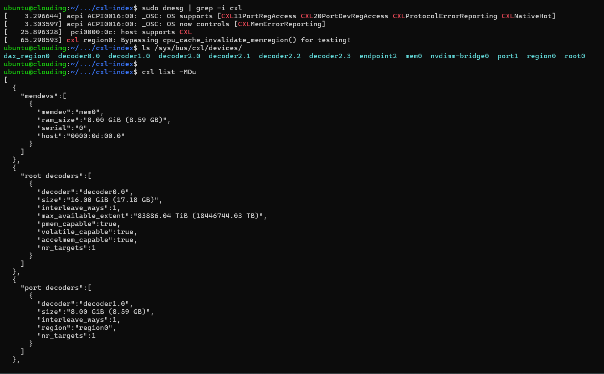
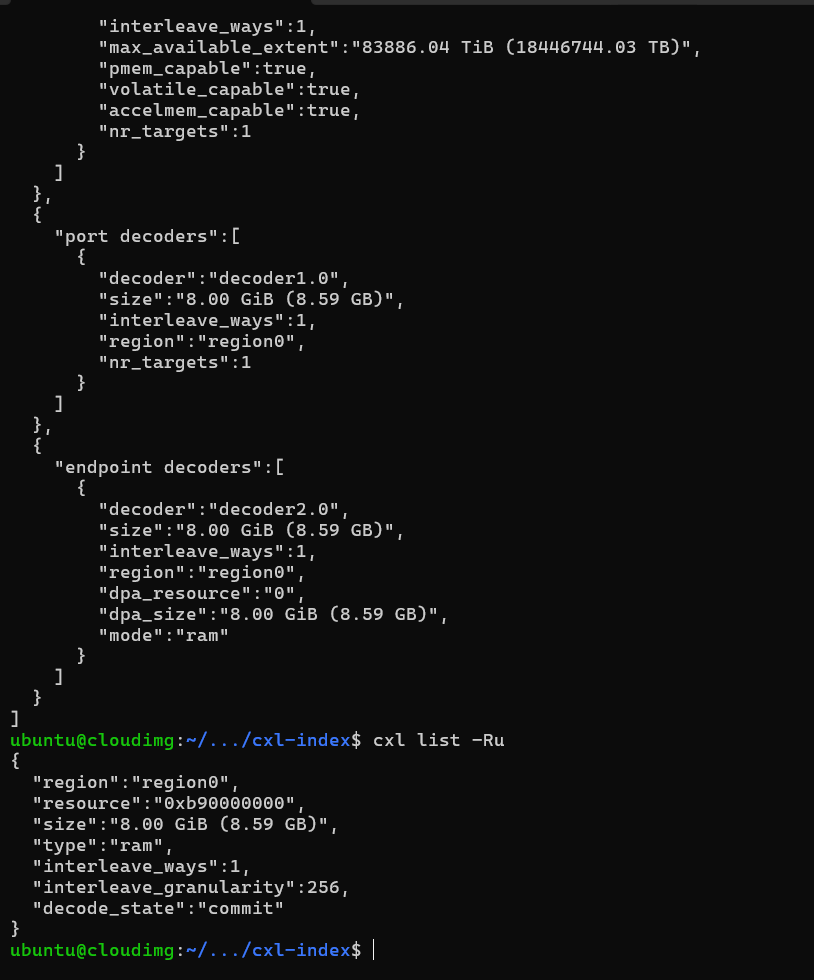
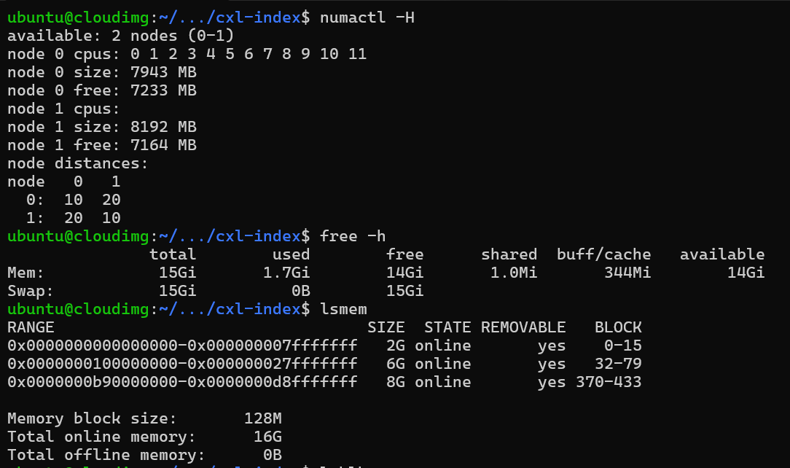

## CXL and HMSDK Setup using QEMU

Started with Ubuntu Plucky : Linux 6.14.08

Had CONFIG_CXL support (after downloading linux-modules-extra and sudo modprobing cxl_mem)

Most helpful doc : [Fujitsu_PDF](https://www.fujitsu.com/jp/documents/products/software/os/linux/catalog/Exploring_CXL_Memory_Configuration_and_Emulation.pdf) among others.

Official QEMU CXL doc : [Qemu website](https://www.qemu.org/docs/master/system/devices/cxl.html)

Key takeaways from doc :

- cxl-fmw.0.size=16G -> this size > size of the CXL memory, to allow creation of CXL region
- KVM inside QEMU CXL will cause issues.

Command to create volatile CXL memory region:

`sudo cxl create-region -m mem0 -d decoder0.0 -t ram` 

The region created will be the size of mem0 (need to ensure size of decoder0.0 > size of mem0 as stated above)

Linux 6.14 with QEMU 9.2 is sufficient to "detect" a CXL device, without needing source build (since we could have all modules asked mandatory on slide 19 (except one))

BUT, issue lies in creating the CXL region:

CXL create-region command fails : 

`cxl region: create_region: region0: failed to commit decode: No such device or address when trying inside qemu vm`

dmesg shows issue with synchronizing cache.

Looking at slide 19 : It mentions, [CONFIG_CXL_REGION_INVALIDATION_TEST](https://www.kernelconfig.io/config_cxl_region_invalidation_test) is essential in **emulation environment**. (Perhaps not needed with actual CXL hardware). Reason : [Reference](https://patchwork.kernel.org/project/linux-nvdimm/patch/166993222098.1995348.16604163596374520890.stgit@dwillia2-xfh.jf.intel.com/)

*Conclusion 1* : Current mainline kernel can support real CXL without rebuild but will most likely need a rebuild for QEMU emulation (because CONFIG_CXL_REGION_INVALIDATION_TEST is unlikely to be y by default)

So we have got one reason to build the kernel : for sake of CONFIG_CXL_REGION_INVALIDATION_TEST=y and CONFIG_MEMORY_HOTPLUG_DEFAULT_ONLINE=y (makes life easier since just creating cxl-region brings memory online).

Also for hmsdk capacity expansion, a DAMON-enabled kernel is needed and if CONFIG_DAMON is not y (mostly true for Ubuntu versions), that gives another reason to build.

So went ahead with compiling the linux submodule in hmsdk repo : it's **Linux 6.12**. Qemu is still 9.2.

Followed this from their wiki:

```bash
$ cd hmsdk/linux
$ cp /boot/config-$(uname -r) .config
$ echo 'CONFIG_DAMON=y' >> .config
$ echo 'CONFIG_DAMON_VADDR=y' >> .config
$ echo 'CONFIG_DAMON_PADDR=y' >> .config
$ echo 'CONFIG_DAMON_SYSFS=y' >> .config
$ echo 'CONFIG_MEMCG=y' >> .config
$ echo 'CONFIG_MEMORY_HOTPLUG=y' >> .config
# also CONFIG_CXL_REGION_INVALIDATION_TEST=y and CONFIG_MEMORY_HOTPLUG_DEFAULT_ONLINE=y
$ make menuconfig
$ make -j$(nproc)
# had to turn off some certificate configs
$ sudo make INSTALL_MOD_STRIP=1 modules_install
$ sudo make headers_install
$ sudo make install
```

After making the GRUB menu visible (which is not in cloud-init by default), we are good to go.

Initial script (almost, since I might have changed some parameter which I may not remember) which first showed some success:

```bash
#!/bin/bash

VAR_MAIN_MEM_SIZE=8
VAR_CXL_MEM_SIZE=8
VAR_CPU_CNT=12
MAX_MEM_SIZE=$((${VAR_MAIN_MEM_SIZE} + ${VAR_CXL_MEM_SIZE} + 20))

qemu-system-x86_64 \
  --nographic \
  -m ${VAR_MAIN_MEM_SIZE}G,maxmem=${MAX_MEM_SIZE}G,slots=8 \
  -machine q35,accel=tcg,cxl=on \
  -smp cpus=$VAR_CPU_CNT \
  -drive file=$1,index=0,format=qcow2,if=none,id=disk0 \
  -device virtio-blk-pci,drive=disk0,id=virtio-disk0 \
  -netdev user,id=net0 \
  -device virtio-net-pci,netdev=net0,bus=pcie.0 \
  -object memory-backend-ram,size=${VAR_CXL_MEM_SIZE}G,id=m1,share=on \
  -device pxb-cxl,bus_nr=12,bus=pcie.0,id=cxl.1 \
  -device cxl-rp,port=0,bus=cxl.1,id=root_port13,chassis=0,slot=2 \
  -device cxl-type3,bus=root_port13,volatile-memdev=m1,id=cxl-vmem0 \
  -M cxl-fmw.0.targets.0=cxl.1,cxl-fmw.0.size=16G
```

This script allowed me to use almost all features, and could start damo through hmsdk as well.

Illustrative Examples :

- Before creating CXL region : 
- After creating CXL region (sudo cxl create-region -m mem0 -d decoder0.0 -t ram):
- 
- 

- Automatically onlined as CPU-less NUMA node due to MEMORY_HOTPLUG_DEFAULT_ONLINE : 
- Being identified as different tiers automatically (yes!) : 

But one catch : Any memory access forced on CXL region led to message : `qemu-system-x86_64: virtio: bogus descriptor or out of resources` in running VM terminal beyond which VM would become unresponsive/hung, would eventually lead to kernel messages system hung on so and so task for this much time. Would have to kill the qemu process as the only option.

Which brings to : **why no kvm** : 

accel=kvm, -cpu host,pmu=on supposedly behave in very weird ways when QEMU runs them for CXL : When using the above script with these 2 lines and forcing memory access on the CXL region, `Bad swap entry` messages would fill the screen, even though benchmark should not exceed capacity of CXL at all (like running a 3G or even 1G benchmark on 8G CXL node). When directly executing the executable instead of the python script (which would usually give benchmark not found), would lead to **Illegal instruction (core dumped)** : again needing to kill the vm. Eg : Membind 0 works but membind 1 fails : . 

Sometimes would get other strange kernel errors, again having to kill the vm finally.
 
*Conclusion 2:* KVM with QEMU for CXL emulation is probably not a good idea at least with this (Linux 6.12 + Qemu 9.2) combination. (Also mentioned in the Fujitsu doc linked above). And looking at this [QEMU Issue](https://gitlab.com/qemu-project/qemu/-/issues/3075), it doesn't seem to be fixed in latest version as well, please correct me on this if you have more info.

What does this imply? : Since we are using TCG, things are pretty slow. And, **no pmu as well** (I think).

About the `qemu-system-x86_64: virtio: bogus descriptor or out of resources` issue, LLM suggested me perhaps it is an I/O issue, and looked like since `./memeater --membind 1` worked, so suggested me this script : 

```bash
#!/bin/bash

cp /usr/share/OVMF/OVMF_VARS_4M.fd my_ovmf_vars.fd

VAR_MAIN_MEM_SIZE=8
VAR_CXL_MEM_SIZE=8
VAR_CPU_CNT=12
MAX_MEM_SIZE=$((${VAR_MAIN_MEM_SIZE} + ${VAR_CXL_MEM_SIZE} + 20))

qemu-system-x86_64 \
  --nographic \
  -m ${VAR_MAIN_MEM_SIZE}G,maxmem=${MAX_MEM_SIZE}G,slots=8 \
  -machine q35,accel=tcg,cxl=on \
  -smp cpus=$VAR_CPU_CNT \
  -drive if=pflash,format=raw,readonly=on,file=/usr/share/OVMF/OVMF_CODE_4M.fd \
  -drive if=pflash,format=raw,file=my_ovmf_vars.fd \
  -drive file=$1,format=qcow2,if=none,id=disk0 \
  -device ich9-ahci,id=ahci \
  -device ide-hd,drive=disk0,bus=ahci.0 \
  -netdev user,id=net0 \
  -device e1000e,netdev=net0 \
  -object memory-backend-ram,size=${VAR_CXL_MEM_SIZE}G,id=m1,share=on \
  -device pxb-cxl,bus_nr=12,bus=pcie.0,id=cxl.1 \
  -device cxl-rp,port=0,bus=cxl.1,id=root_port13,chassis=0,slot=2 \
  -device cxl-type3,bus=root_port13,volatile-memdev=m1,id=cxl-vmem0 \
  -M cxl-fmw.0.targets.0=cxl.1,cxl-fmw.0.size=16G
```

Not sure why the firmware lines are needed and if they are really helpful. This allowed me to run `gups 1G --membind node 1` (finally!) but it was terribly slow. Also a more ambitious benchmark (like `gups 3G with 6G hogged`)

Tried today this script directly inspired from the PDF : 

```bash
#!/bin/bash

VAR_MAIN_MEM_SIZE=8
VAR_CXL_MEM_SIZE=8
VAR_CPU_CNT=12
MAX_MEM_SIZE=$((${VAR_MAIN_MEM_SIZE} + ${VAR_CXL_MEM_SIZE} + 20))

qemu-system-x86_64 \
  -drive file=$1,format=qcow2,index=0,media=disk,id=hd \
  -m ${VAR_MAIN_MEM_SIZE}G,maxmem=${MAX_MEM_SIZE}G,slots=8 \
  -machine type=q35,accel=tcg,cxl=on \
  -smp $VAR_CPU_CNT \
  -nographic \
  -device e1000,netdev=net0 \
  -netdev user,id=net0 \
  -object memory-backend-ram,size=${VAR_CXL_MEM_SIZE}G,id=m1,share=on \
  -device pxb-cxl,bus_nr=12,bus=pcie.0,id=cxl.1 \
  -device cxl-rp,port=0,bus=cxl.1,id=root_port13,chassis=0,slot=2 \
  -device cxl-type3,bus=root_port13,volatile-memdev=m1,id=cxl-vmem0 \
  -M cxl-fmw.0.targets.0=cxl.1,cxl-fmw.0.size=16G
```

Quite similar to the last once, just without the firmware lines. This one again allows to access CXL memory but terribly slow.

Case in point : 

`numactl --membind 0 ./bench/apps/gups/gupstoy 1G 0` : Completed under 4 mins

`numactl --membind 1 ./bench/apps/gups/gupstoy 1G 0` : Not completed even after 4 hours (took more than 1 hr just to occupy 1G on CXL)

Illustrative Examples :

- Still loaded just 877M/1G in 1h : 
- Able to use 1G on CXL : 
- *An interesting observation*: numa_hits on node 1 increase rapidly when amount of memory loaded in it is increasing (as expected), but more or less **stagnates** once 1G allocation is complete but the benchmark is running, while node0 numa hits increase much more rapidly. Examples :
  -  
  -  
  - 


A more ambitious benchmark (in current settings atleast), like hogging large portion on node 0, will make system "very slow" to the point of unresponsive, the benchmark may not complete (or sometimes not even start).

*Can we improve this, speed this up, make it usable?*:  Will try to look into it, but no answer currently.

**GUPS Benchmark with CXL nodes**

DDR RAM : 12 cores and 8G at node 0
CXL : no cores and 8G at node 1

Designed such that max CXL used memory reaches 200M in one of them (and 0 for 1G and 5G without memory hogging):

Committed at `experiments/cxl-attached-gups`:

No HMSDK, only NUMA_balancing (combined with memory hogging for one case) :

NUMA config common for all 

```json
"numa_balancing": {
            "numa_balancing": "2",
            "demotion_enabled": "true",
            "zone_reclaim_mode": "1",
            "lru_gen_enabled": "0x0000",
            "hot_threshold_ms": "1000",
            "scan_delay_ms": "1000",
            "scan_period_max_ms": "1100",
            "scan_period_min_ms": "1000",
            "scan_size_mb": "1024"
            }
```

| Metric                            | GUPS 1G | GUPS 5G | GUPS 1G with 6000M memhog | GUPS 7G |
| :-------------------------------- | :------ | :------ | :------------------------ | :------ |
| **numa_hit**                      | 285190  | 1340912 | 309789                    | 1945183 |
| **numa_miss**                     | 0       | 0       | 5848                      | 37208   |
| **numa_foreign**                  | 0       | 0       | 5848                      | 37208   |
| **numa_interleave**               | 0       | 0       | 0                         | 0       |
| **numa_local**                    | 285190  | 1340912 | 285244                    | 1887016 |
| **numa_other**                    | 0       | 0       | 30393                     | 95375   |
| **pgpromote_success**             | 29      | 0       | 5470                      | 45657   |
| **pgpromote_candidate**           | 0       | 0       | 96815                     | 217138  |
| **pgdemote_kswapd**               | 0       | 0       | 23700                     | 56494   |
| **pgdemote_direct**               | 0       | 0       | 0                         | 0       |
| **pgdemote_khugepaged**           | 0       | 0       | 0                         | 0       |
| **pgalloc_dma**                   | 0       | 0       | 3443                      | 3410    |
| **pgalloc_dma32**                 | 0       | 29934   | 236649                    | 469456  |
| **pgalloc_normal**                | 285636  | 1311514 | 75976                     | 1510320 |
| **pgfault**                       | 294634  | 1350134 | 400053                    | 2450348 |
| **pgmajfault**                    | 5       | 25      | 24                        | 25      |
| **kswapd_low_wmark_hit_quickly**  | 0       | 0       | 0                         | 0       |
| **kswapd_high_wmark_hit_quickly** | 0       | 0       | 6                         | 15      |
| **numa_pte_updates**              | 80      | 0       | 102902                    | 522354  |
| **numa_huge_pte_updates**         | 0       | 0       | 0                         | 0       |
| **numa_hint_faults**              | 29      | 0       | 101691                    | 513410  |
| **numa_hint_faults_local**        | 0       | 0       | 0                         | 0       |
| **numa_pages_migrated**           | 29      | 0       | 5470                      | 45691   |
| **pgmigrate_success**             | 29      | 0       | 29489                     | 102345  |
| **pgmigrate_fail**                | 0       | 0       | 521                       | 1506    |


**Some words on HMSDK (Capacity Expansion)**

[Reference](https://github.com/skhynix/hmsdk/wiki/Capacity-Expansion)

From what I could grasp, for capacity expansion / memory tiering, HMSDK uses existing DAMON and DAMOS frameworks  and adds promotion/demotion actions (integrated in kernel 6.11 onwards, hence no local patch needed). From initial read, it seems to just helping in creating the initial .yaml config for `damo`, (in which we have to specify promotion and demotion targets, ie we need not depend on auto detection).

DAMO Usage : [doc](https://github.com/awslabs/damo/blob/next/USAGE.md)

Apart from that, I believe we have to interact with damo interface only and in order to tune it (if needed), its advanced options need to be studied.

I have tried a very simple setup currently :

```bash
$ sudo ~/hmsdk/tools/gen_migpol.py --demote 0 1 --promote 1 0 -o ~/hmsdk.yaml
echo true | sudo tee /sys/kernel/mm/numa/demotion_enabled
sudo mount -t cgroup2 none /sys/fs/cgroup
echo '+memory' | sudo tee /sys/fs/cgroup/cgroup.subtree_control
sudo mkdir -p /sys/fs/cgroup/hmsdk
sudo ~/hmsdk/damo/damo start ~/hmsdk.yaml
```

This starts damo with provided config, config will depend on device connected (different for CXL or memory numa node).

To see a snapshot of active damo's stats:

```bash
$ sudo ~/hmsdk/damo/damo show
```

Stop damo with:

```bash
$ sudo ~/hmsdk/damo/damo stop
```

`damo show` when running a benchmark : 

Since we are only concerned with how HMSDK affects promotions/demotions only (I believe), hence currently limiting myself to these commands. Apart from them key commands are `damo record` and `damo report <subcommand>` but not using them since (I think) we don't need statistics from DAMON, we only require its `migrate_cold` and `migrate_hot` actions. Also, `damo record` needs perf.

Could use `damo` commands when working with cxl node as well : 
- 
- 

**HMSDK benchmarks (with two NUMA nodes and NOT CXL)**

Ran with this qemu config : 

```bash
#!/bin/bash

VAR_FAST_MEM_SIZE=8
VAR_SLOW_MEM_SIZE=8
VAR_CPU_CNT=12

qemu-system-x86_64 \
    --enable-kvm \
    --nographic \
    -m 16G \
    -cpu host,pmu=on \
    -smp $VAR_CPU_CNT \
    -drive file=$1,index=0,format=qcow2,if=virtio \
    -object memory-backend-ram,size=${VAR_FAST_MEM_SIZE}G,id=m0 \
    -object memory-backend-ram,size=${VAR_SLOW_MEM_SIZE}G,id=m1 \
    -numa node,nodeid=0,cpus=0-$((VAR_CPU_CNT-1)),memdev=m0 \
    -numa node,nodeid=1,memdev=m1 \
    -netdev user,id=net0 \
    -device virtio-net-pci,netdev=net0
```

Committed at `experiments/hmsdk_damon_numa`:

Ran GUPS for 9G without memory hogging for 4 cases :
- hmsdk/damo enabled but numa_balancing disabled (demotion_enabled=true though as per hmsdk usage guidelines)
- numa_balancing enabled but damon stopped
- both hmsdk/damo and numa_balancing enabled
- neither hmsdk/damo nor numa_balancing enabled

**NOTE**: From usage guidelines of hmsdk, it is by default enabled for a cgroup and can also be enabled globally. I tried both, one default with group and adding gupstoy pid to cgroup/hmsdk.procs and other globally with -g flag. Now, main difference I came across in both is that *pgmigrate_success* and *pgmigrate_fail* came 0 for cgroup case and non-zero globally. Otherwise, pgpromote, demote and numa_pages_migrated were 0 for both. Not sure if this is expected. Please go through them if needed.

To give an idea of latency wrt CXL, GUPS 7G in previous case took more than 20mins, where CXL occupied was around 200M. Here it took around 2 mins, even though 2.2G of node 1 were occupied.

---

PS: You can boot the VM yourself. You can find it at my account at : `/home/roopam/epfl-research-intern/qemu-vms/epfl-vm.img`. The three scripts used are `cxl-vm.sh`, `new-hope.sh` and `boot.sh`. Inside the VM, please select Linux 6.12+ (it's also the default option in the grub menu).

Login : ubuntu   Password : roopam1234

PS2 : Powering off VM writes some garbage on terminal sometimes. So better idea to sudo poweroff and start again instead of sudo reboot.
